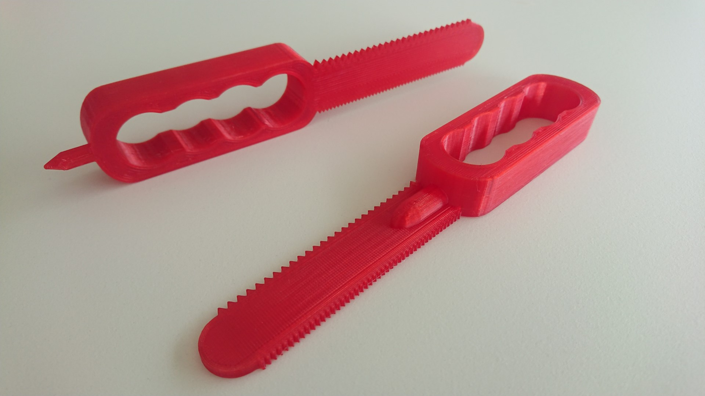

# Cardboard Saw

Cardboard saw that can be used as an alternative for makedo provided saw.
Created on request of my sons school to replace broken parts.

## Result

## Inspiration
The source I used is this one: https://www.thingiverse.com/thing:460232
I wanted to edit this in OpenSCAD and used this STL to OpenSCAD converter to be able to edit it.

I noticed the grip was just to big for my son and he was putting his fingers through the holes. However that didn't fit perfectly. So redesigned the handle to allow and easier grip (with fingers through the center of the handle).

In addition added a tiny chamfer to the saw blade to get the cut to start just a little bit easier.
